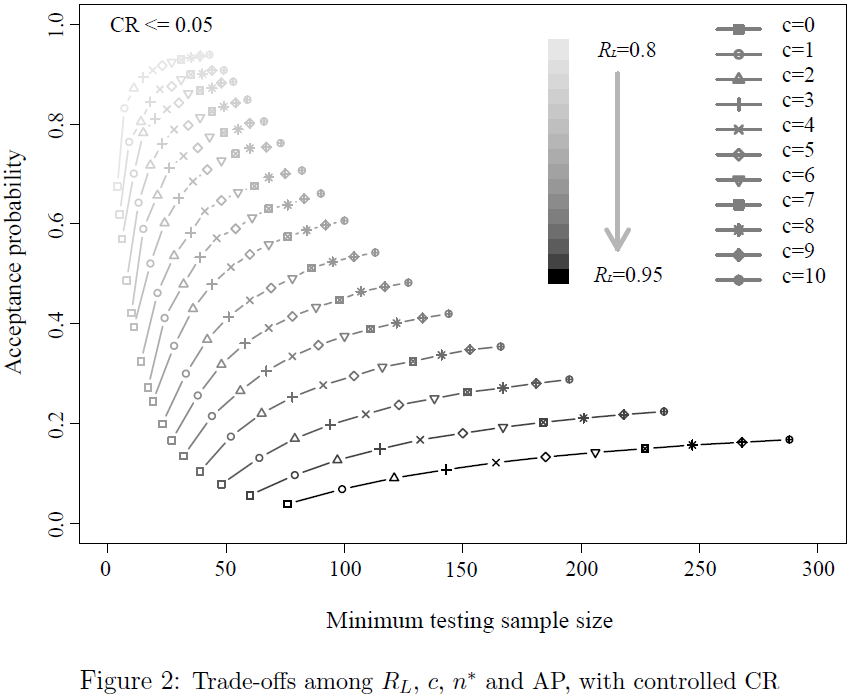

# BRDT_QE2020

## About
This is a demo to demonstrate the work of optimal binomial reliabiltiy demonstration test (BRDT) designs, from one of the research projects listed in [Suiyao Chen's Homepage](https://sites.google.com/mail.usf.edu/suiyaochen-professional/publication?authuser=0). The related paper is "Optimal Binomial Reliability Demonstration Tests Design Under Acceptance Decision Uncertainty". The related presentation slides are "Optimal Design Of Reliability Demonstration Tests With Risk-adjusted Costs".

The paper [Optimal Binomial Reliability Demonstration Tests Design Under Acceptance Decision Uncertainty](https://www.researchgate.net/publication/341910431_Optimal_binomial_reliability_demonstration_tests_design_under_acceptance_decision_uncertainty) has been published in [Quality Engineering](https://www.tandfonline.com/doi/abs/10.1080/08982112.2020.1757703?journalCode=lqen20). To cite this paper, please use 
> Suiyao Chen, Lu Lu, Qiong Zhang & Mingyang Li (2020) Optimal binomial reliability demonstration tests design under acceptance decision uncertainty, Quality Engineering, DOI: 10.1080/08982112.2020.1757703

## Instructions
The RDT design is based on Monte Carlo Simulation.
- **functions.R** contains all the functions to generate simulation datasets.
- **Plot.R** is used to generate all the plots.
- **data_generator.R** is used for to generate different simulation datasets based on different priors and design settings.

#### The tradeoff among different design parameters is shown as below:

## [R Package](Rpackage)
[BRDT](https://github.com/ericchen12377/BRDT) is the related R package for the project. 
